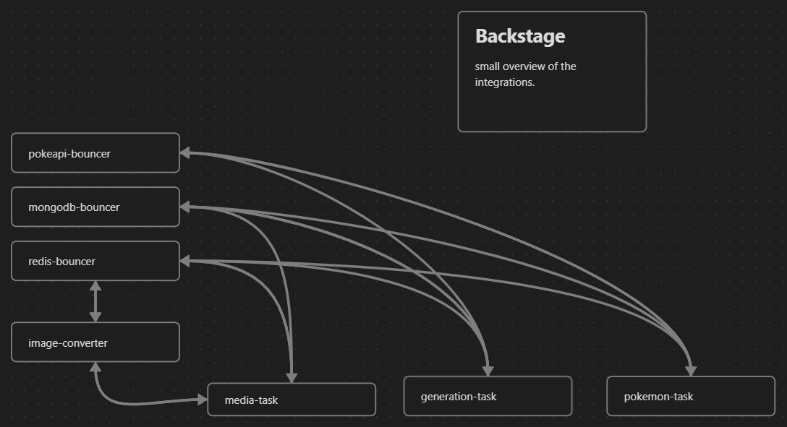

# Backstage

- Tasks that is compiled as Native Images used a Function as a Service(FaaS)
    - generation-task
    - pokemon-task
    - media-task
- Image converter service converts images to .webp
- Bouncer applications that relays and handle connection pooling to the datasources
    - Redis
    - Mongodb

## To Run

Native images are generated based on your OS

- `mvn -U clean install` - Compiles,tests and installs all modules.
- `mvn native:compile -Pnative` - Generates native executables. Note that this might take some time.
- `mvn -PnativeTest test` - Run native image tests - (might not be very useful since e2e tests them in containers)

## Docker

Dockerfiles for the tasks and bouncers include a GraalVM image ready to compile.

- Refer to `minikube.ps1` and `docker-build.ps1` for the build steps.

## Modules

### generation-task

- Add Stream logs to `pokemon-name-event`

### image-converter

- Converts Images to WebP format
- gRPC server

### integration

- PokeApi - HTTP RestClient
- Redis - gRPC Client
- MongoDB - gRPC Client

### media-task

- Read Stream Logs from `pokemon-media-event`
- Updates the Pokémon document with the new media entry.
- Downloads the media from source
- Adds a reference to the file server API for the source.
- Inserts media into GridFS.

### shared

- Shared objects
- Shared Proto implementations.
- Native image reflection stuffs
- Utility

### pokeapi-bouncer

- Relays and caches http requests from pokeapi.co

### pokemon-task

- Read Stream Logs from `pokemon-name-event`
- Updates the database with new Pokémon.
- Runs a side effect and add Stream Logs (images and cries) into the `pokemon-media-event`.

### redis-bouncer

- Redis bouncer service to handle connection pooling.
- gRPC Server.
- Relays requests to and from Redis.

### mongodb-bouncer

- MongoDB bouncer service to handle connection pooling.
- gRPC Server.
- Relays requests to and from MongoDB.
